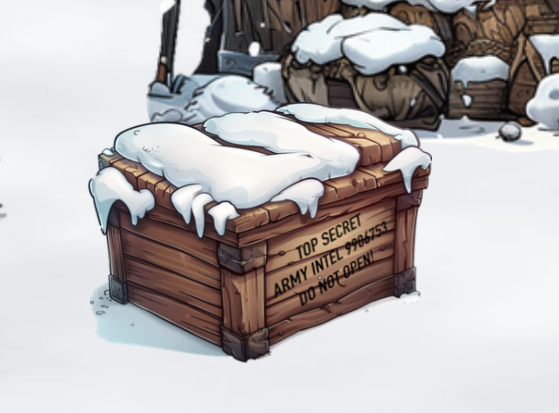
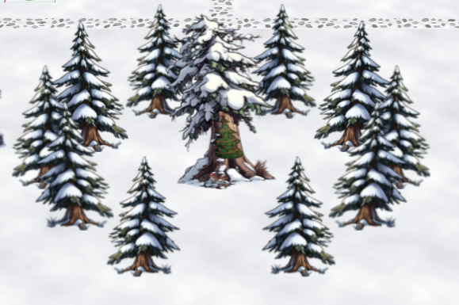
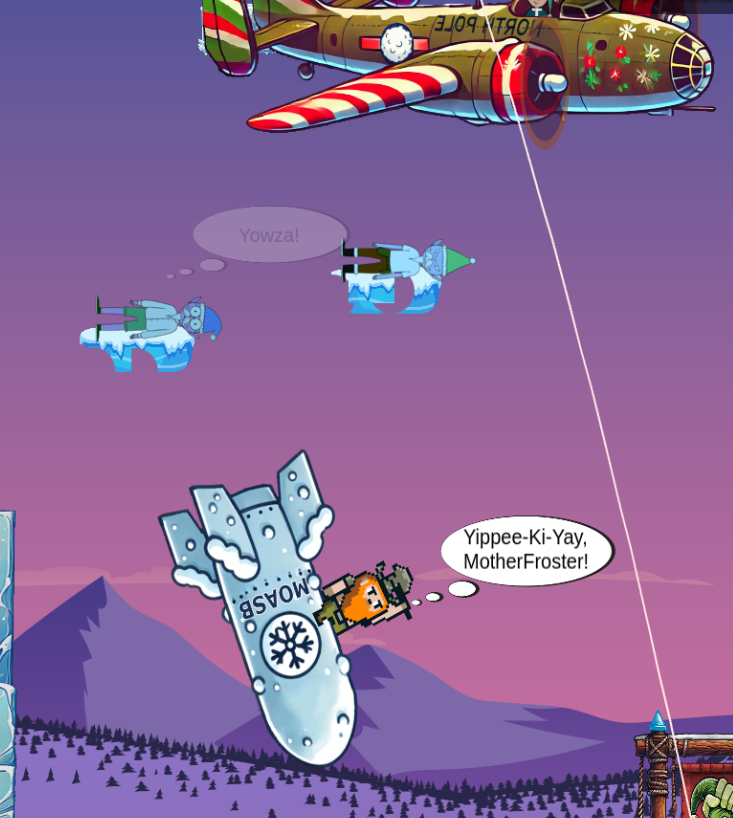

# Holiday Eggs

### Dad Jokes
In the objective Hardware Hacking 101 Part 1 is a function `dad` which retrieves dad jokes from the backend (in context `Hardware Hacking 101`.   


### Crate 9906753
The crate in (14/42) of the Front Yard labelled   
**TOP SECRET**  
**ARMY INTEL 9906753**  
**DO NOT OPEN!**  
is a reference to [Indiana Jones](https://indianajones.fandom.com/wiki/9906753).   


### Dock
In the lower left corner of the Front Yard (2/58) is a signpost labelled "Dock". To the right is an exit of the screen and the character is taken to the prologue level.   


### The Nightmare before Christmas
In the lower center of the Frost Yard is a circle of trees. In the center (41/48) is a portal leading to the North Pole Monitoring Station.
This is a reference to the film [The Nightmare before Christmas](https://en.wikipedia.org/wiki/The_Nightmare_Before_Christmas).   


### Twas The Night Before Christmas
The "[Frost-y-Book](https://frost-y-book.com/)" is "Twas The Night Before Christmas" by Clement Clarke Moore.

### Captain Planet
In the Elf Minder objective there are references to [Captain Planet](https://en.wikipedia.org/wiki/Captain_Planet_and_the_Planeteers). Different error conditions/exceptions result in the error messages:
 - Invalid game data [Heart] → Ma-Ti
 - Invalid game data [Earth] → Kwame
 - Invalid game data [Wind] → Linka
 - Invalid game data [Water] → Gi
 - Invalid game data [Fire] → Wheeler
 - Invalid game data [CAPTAIN PLANET!]
        
### Jason
This year Jason is in a box on Frosty's Beach. This box does only appear if you move to Frosty's Beach by following the signpost in the lower left corner of the Front Yard area.   


### Holiday Hack Challenge 2023
The Geese on Frosty Island have internally still the names from HHC2023: goosepixel, goosechristmas2, goosenoir, goosespace, goosesteampunk, goosemisfit.

### Dwarf on MOASB
The dwarf on the MOASB (Snowball Challenge) shouts "Yippee-Ki-Yay, MotherFroster!" which is a reference to the "Die Hard" films.



### Shenanigans
This year the Shenanigans areas re-appeared. It is possible to teleport there using a web socket message with a non-existing target like this:
```
{
  "type":"TELEPORT_USER",
  "destination":"frontyardact4",
  "entranceName":"frontyardact3-oh2"
}
```


The area marked red is not accessible, because according to the raw data there is a "santamagic" terminal:
```
"terminal":[{"id":"santamagic","x":16,"y":5,"z":1}],
```
The exit on the upper left just leads into a black nowhere.
<!--stackedit_data:
eyJoaXN0b3J5IjpbMTM3ODk5MzA3NiwxNzA0Mjg2Njc0LDc1MD
U1MDcxNl19
-->