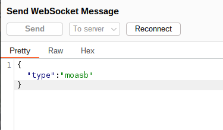
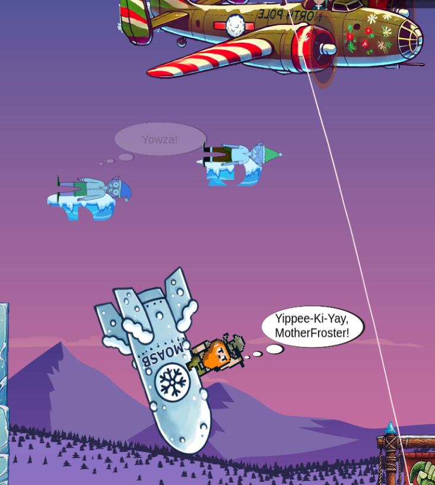

# Objective 11: Snowball Showdown

**Difficultree: 🎄🎄**  
**Location: Front Yard (Act 2), West**

The objective is to win a virtual snowball fight against Wombley.
This is a cooperative two player game, but with adding "singlePlayer=true" to the URL it is also possible to play it as a single player game.

## Silver 🥈
The the easy move, Burp was used to modify the Javascript code of the application.
By modifying the game code with setting `this.onlyMoveHorizontally = false;` it is possible to move also vertically in the game. Positioning the player on the ice block in the screen center it is easy to win against Wombley.

**Achievement: [Silver] Snowball Showdown**

## Gold 🥇
For hard we received the hint to use a secret weapon.
Analyzing the code shows that there is a web socket message type "moasb", presumably referring to "Mother of all Snow Bombs".
```javascript
this.moasb = () => { this.ws.sendMessage({ type: 'moasb' }) }
```
Sending this according message via the web socket to the backend using Burp



summons a plane with a huge bomb. Wombley is defeated immediately.


**Achievement: [Gold] Snowball Showdown**
<!--stackedit_data:
eyJoaXN0b3J5IjpbMTIwMDYxNDM3OCwtMTY1NzQwOTI0OF19
-->