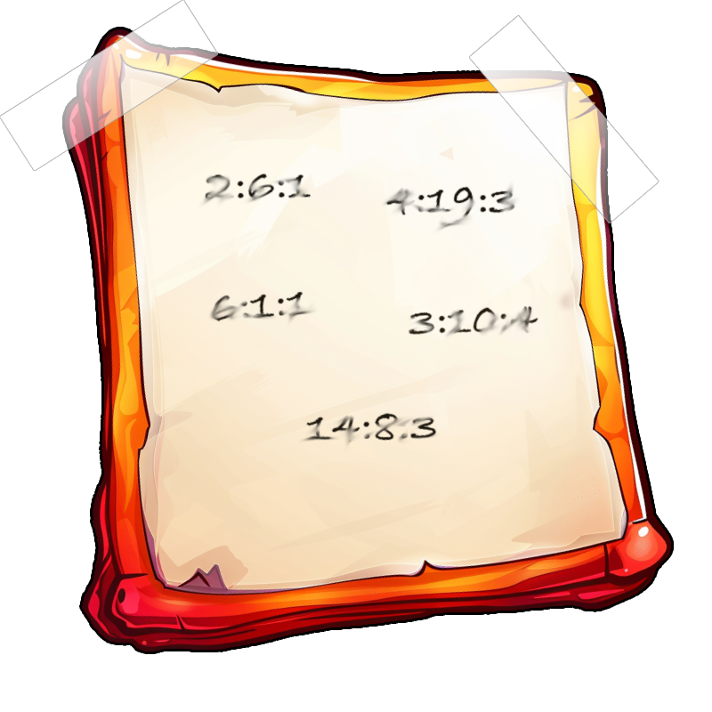
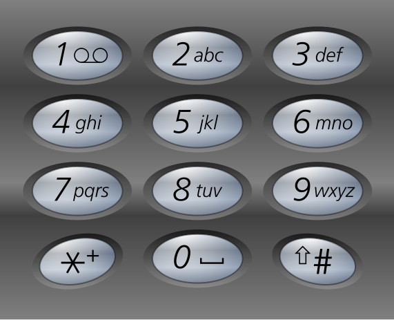

# Objective 5: Frosty Keypad

**Difficultree: 🎄**  
**Location: The Front Yard**

The objective is to enter a secret numeric code into the terminal keypad.
Using the found UV Flashlight it is possible to determine, that the keys 2, 5, 7, 8, and "Enter" are used - but possibly digits are used twice for the right code.
The note on the keypad contains an Ottendorf cipher which can be applied to the found [book](https://frost-y-book.com/).

With the interpretation as *page*:*word*:*character*, the values 2:6:1 4:19:3 6:1:1 3:10:4 14:8:3 end up in "SANTA".

## Easy 🥈
Keying in `72682` for **Santa** solves the easy mode.
This translation is done using the normal telephone keypad.

**Achievement: [Silver] Frosty Keypad**

## Hard 🥇
The second combination was found using the Perl tool [rapid-fingers.pl](rapid-fingers.pl) to brute force the keypad.
It finds that `22786` is the second valid code.

**Achievement: [Gold] Frosty Keypad**
<!--stackedit_data:
eyJoaXN0b3J5IjpbLTEwODM1MjIyNzRdfQ==
-->