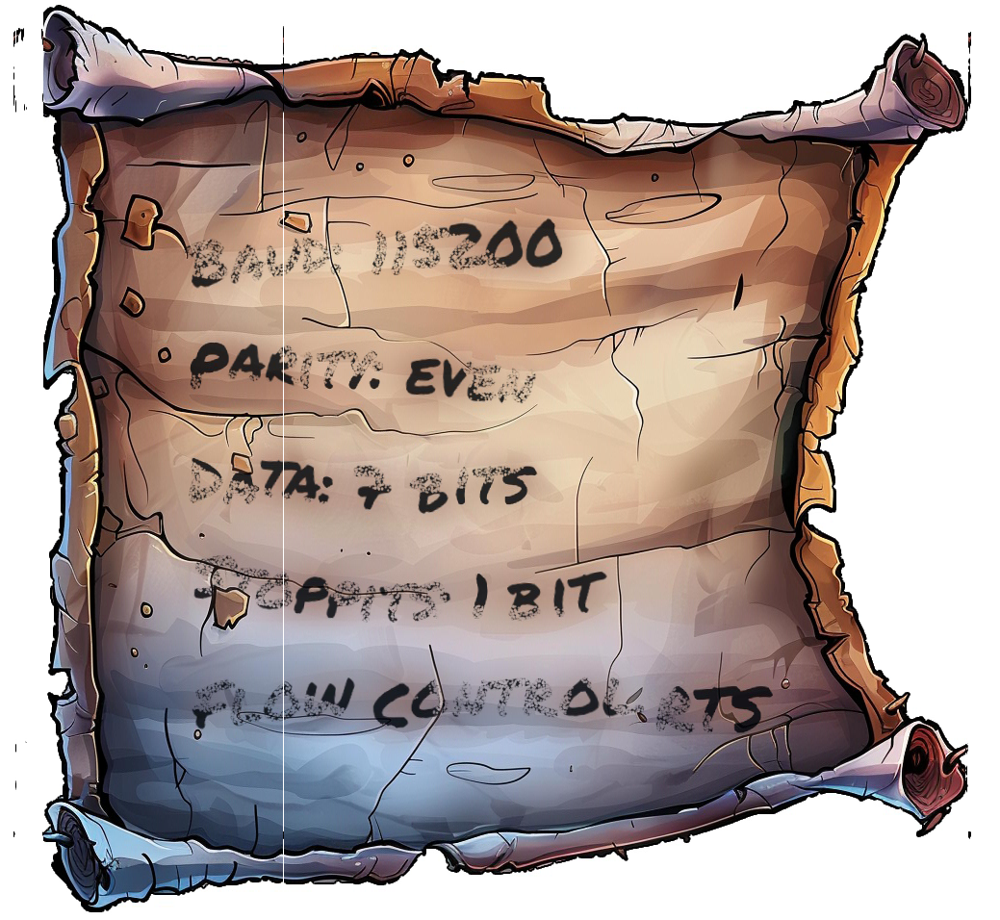
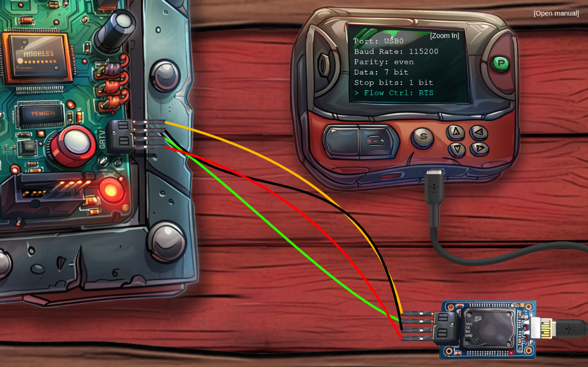
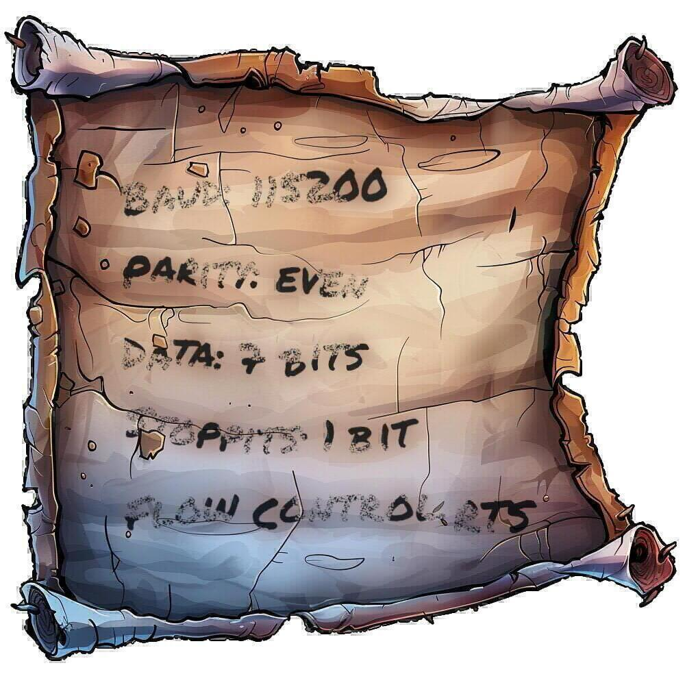

# Objective 6: Hardware Hacking 101 Part 1

**Difficultree: 🎄**  
**Location: The Front Yard**


## Silver 🥈
The objective is to connect the "Santa's Little Helper tool" to a serial UART interface using jumper cables. In addition, the right settings for the serial connection have to be found.
Hints for the serial connections settings are provides by an image shredded into 1000 pieces along with a [Python script](https://gist.github.com/arnydo/5dc85343eca9b8eb98a0f157b9d4d719) for recovering the image using edge detection.

The scripts does a very good job. The resulting combined image just has to be shifted and flipped.



So the desired settings are:
- Baud: 115200
- Parity: even
- Data: 7 Bits
- Stoppits [sic!]: 1 Bit
- Flow Control: RTS

In addition, four jumper cables have to be plugged correctly:
- V ↔ VCC
- T ↔ RX
- R ↔ TX
- G ↔ GND

Having wired everything and set voltage to 3V and the serial port to "USB0", the connectivity works as required.



**Achievement: [Silver] Hardware Hacking 101 Part 1**


## Gold 🥇
The Gold part can be solved with taking a look into the Javascript sources:
```
// Build the URL with the request ID as a query parameter
// Word on the wire is that some resourceful elves managed to brute-force their way in through the v1 API.
// We have since updated the API to v2 and v1 "should" be removed by now.
// const url = new URL(`${window.location.protocol}//${window.location.hostname}:${window.location.port}/api/v1/complete`);
```
Using the browser's developer console, we can build on the last HTTP POST request for solving part 1 (https://hhc24-hardwarehacking.holidayhackchallenge.com/api/v2/complete).
Using "Edit and Resend" from the browser tools, the URL can be modified from "v2" to "v1", which solves the objective.

**Achievement: [Gold] Hardware Hacking 101 Part 1**

## Additional
There is a hidden message spread across the EXIF data of the individual images.
```
jsw@northpole:~/Shred$ exiftool slices/0787b832-d3ae-404b-b7a5-27ba58c61f49.jpg
[...]
User Comment                    : WyI1Y0ROIiwgIml0aCJd
[...]
```
This data can be base64 decoded:
```
["5cDN", "ith"]
```
When visiting the data of all images, it is clear that the second halves are parts of a text. The first halves looks again like base64 encoded data.   
When reviewing the EXIF data of `50595a41-ec0a-4394-bd1d-4a6ea3ab64bf.jpg` (`=AjM`) it is clear that the data has to be post-processed, as a `=` character can only appear in the end of base64 encoded data.
But reversing it leads to integers across all images. So these integers were used as index to recombine the text fragments using [this Perl script](uncover.pl):


> Long ago, in the snowy realm of the North Pole (not too far away if
> you're a reindeer), there existed a magical land ruled by a mysterious
> figure known as the Great Claus. Two spirited elves, Twinkle and
> Jangle, roamed this frosty kingdom, defending it from the perils of
> holiday cheerlessness. Twinkle, sporting a bright red helmet-shaped
> hat that tilted just so, was quick-witted and even quicker with a
> snowball. Jangle, a bit taller, wore a green scarf that drooped like a
> sleepy reindeer’s ears. Together, they were the Mistletoe Knights, the
> protectors of the magical land and the keepers of Claus’ peace. One
> festive morning, the Great Claus summoned them for a critical quest.
> 'Twinkle, Jangle, the time has come,' he announced with a voice that
> rumbled like thunder across the ice plains. 'The fabled Never-Melting
> Snowflake, a relic that grants one wish, lies hidden beyond the
> Peppermint Expanse. Retrieve it, and all marshmallow supplies will be
> secured!' Armed with Jangle’s handmade map (created with crayon and a
> lot of optimism), the duo set off aboard their toboggan, the
> Frostwing. However, the map led them in endless loops around the
> Reindeer Academy, much to the amusement of trainee reindeer perfecting
> their aerial maneuvers. Blitzen eventually intercepted them,
> chuckling, 'Lost, fellas? The snowflake isn’t here. Try the Enchanted
> Peppermint Grove!' Twinkle facepalmed as Jangle pretended to adjust
> his map. With Blitzen’s directions, they zoomed off again, this time
> on the right course. The Peppermint Grove was alive with its usual
> enchantments—candy cane trees swayed and sang ancient ballads of epic
> sleigh battles and the triumphs of Claus’ candy cane squadrons.
> Twinkle and Jangle joined the peppermint choir, their voices
> harmonizing with the festive tune. Hours later, the duo stumbled upon
> a hidden cave guarded by giant gumdrop sentinels (luckily on their
> lunch break). Inside, the air shimmered with Claus’ magic. There it
> was—the Never-Melting Snowflake, glistening on a pedestal of ice.
> Twinkle’s eyes widened, 'We’ve found it, Jangle! The key to infinite
> marshmallows!' As Twinkle reached for the snowflake, a voice boomed
> from the cave walls, 'One wish, you have. Choose wisely or face the
> egg-nog of regret.' Without hesitation, Jangle exclaimed, 'An endless
> supply of marshmallows for our cocoa!' The snowflake glowed, and with
> a burst of magic, marshmallows poured down, covering the cave in a
> fluffy, sweet avalanche. Back at the workshop, the elves were hailed
> as heroes—the Marshmallow Knights of Claus. They spent the rest of the
> season crafting new cocoa recipes and sharing their bounty with all.
> And so, under the twinkling stars of the northern skies, Twinkle and
> Jangle continued their adventures, their mugs full of cocoa, their
> hearts full of joy, and their days full of magic. For in the North
> Pole, every quest was a chance for festive fun, and every snowflake
> was a promise of more marshmallows to come.

The same script uses the same indexing to re-combine the image from the individual shredded parts:   

<!--stackedit_data:
eyJoaXN0b3J5IjpbODI4MjEwNTg3LC0zOTUyODYzMjBdfQ==
-->